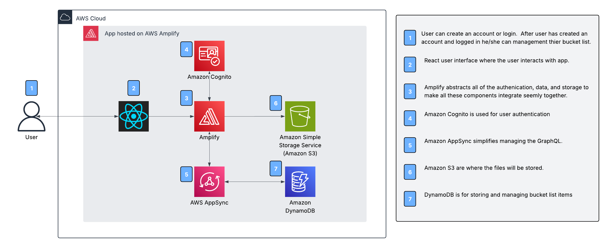
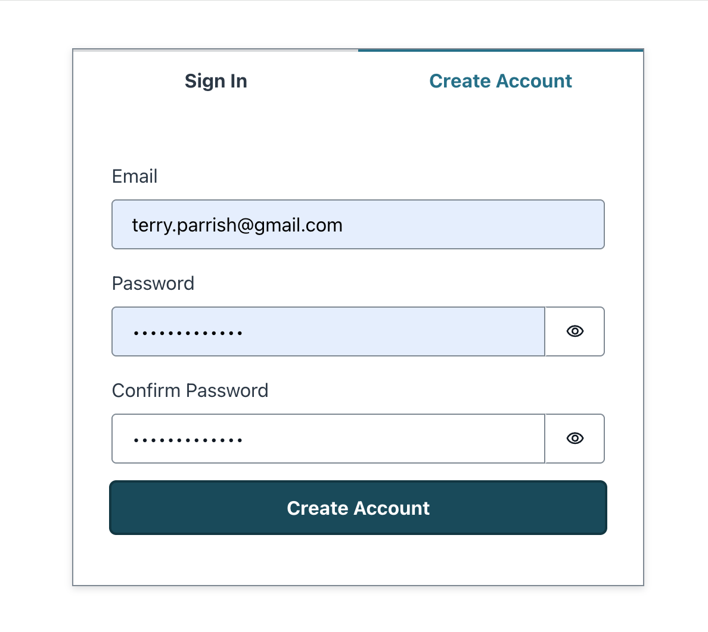
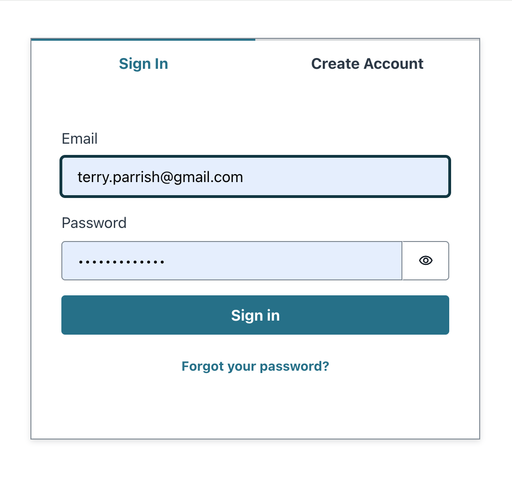
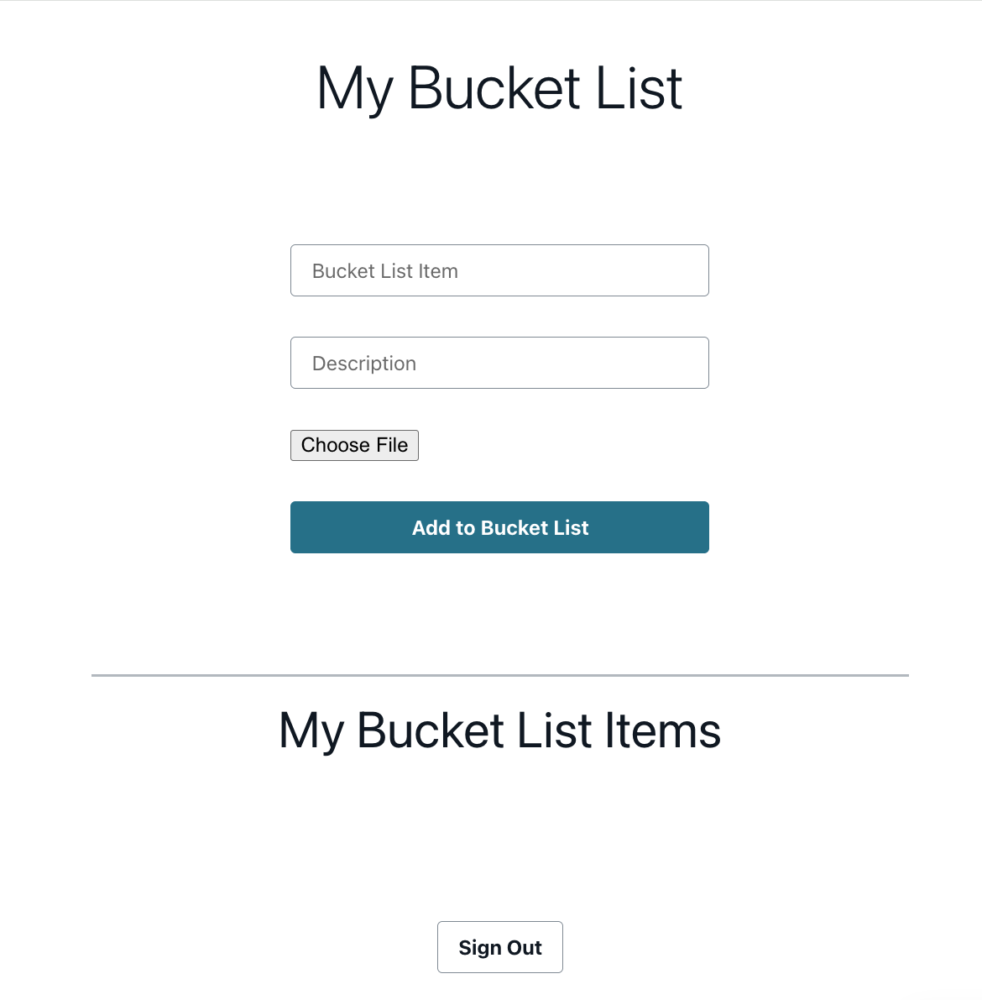
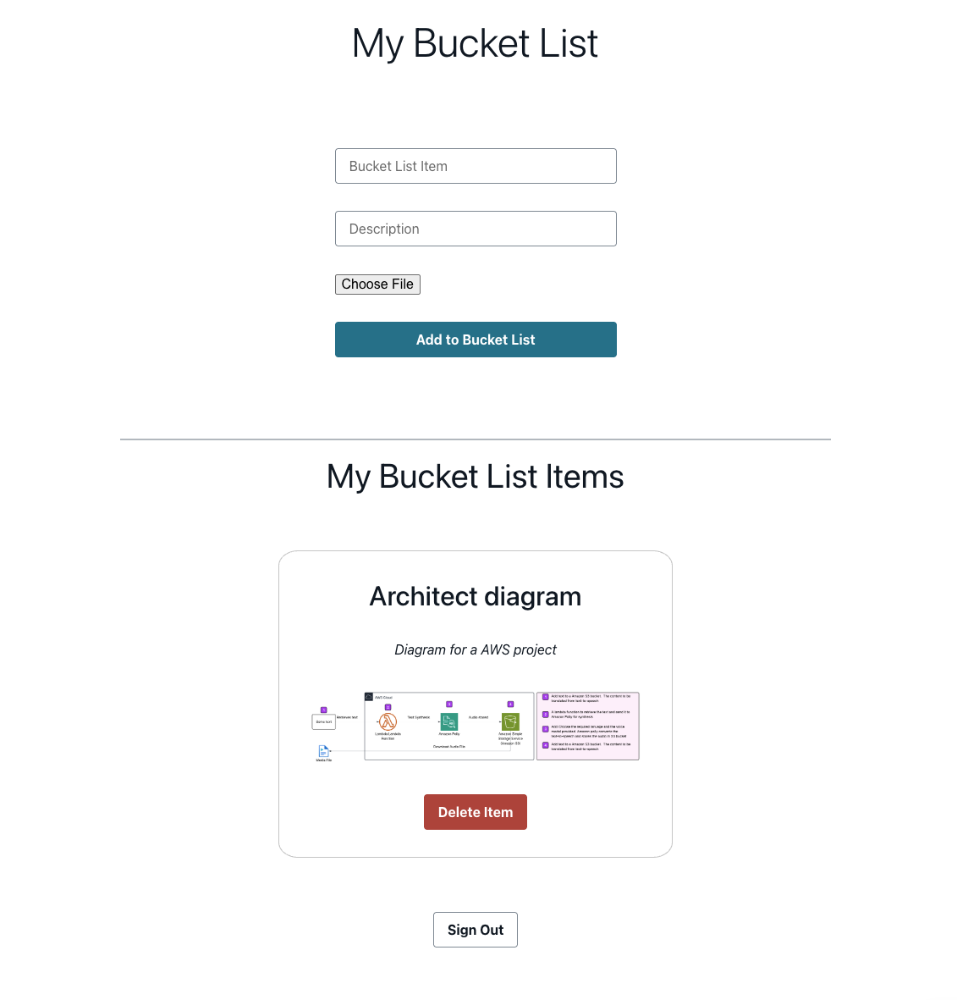

# Bucket list tracker

## 🌟 Overview
In this project, I successfully developed and deployed a full-stack application utilizing AWS Amplify, designed to track and manage items stored in an Amazon S3 bucket. The application features a modern and responsive frontend built with React and Vite, providing users with an intuitive interface for real-time item management.

On the backend, the application leverages AWS DynamoDB for efficient NoSQL data storage, complemented by AWS Cognito to ensure secure user authentication and management. This combination of technologies enables seamless data handling and robust security protocols.

### Key Benefits of Using AWS Amplify
AWS Amplify was chosen for its ability to streamline the development process and enhance productivity:

* **Rapid Development**: Amplify simplifies the building and deployment of scalable web and mobile applications, allowing for quicker iterations and time-to-market.
* **Simplified Integration**: It abstracts complex AWS services, enabling straightforward integration of essential features such as authentication, data management, and APIs.
* **Integrated Hosting**: The platform provides native hosting with continuous integration and delivery (CI/CD), facilitating automated deployment and reducing manual overhead.
* **Cross-Platform Compatibility**: Amplify supports development across various platforms, including web, iOS, Android, and Flutter, making it a versatile choice for diverse user bases.
* **Ideal for Prototyping**: It accelerates the transition from conceptualization to production, allowing for quick prototyping with minimal infrastructure management.
* **Automated Backend Provisioning**: Amplify handles backend setup and hosting automatically, enabling developers to focus primarily on frontend development and user experience.

This project exemplifies the effectiveness of combining modern web technologies and cloud services to create scalable and maintainable applications with ease.

## ☁️ Architecture

## &rarr; Final Result
### Create an account

### Sign in

